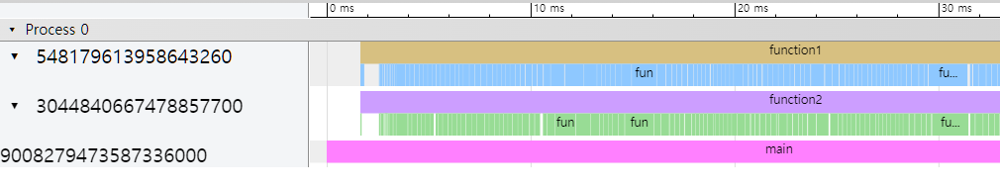
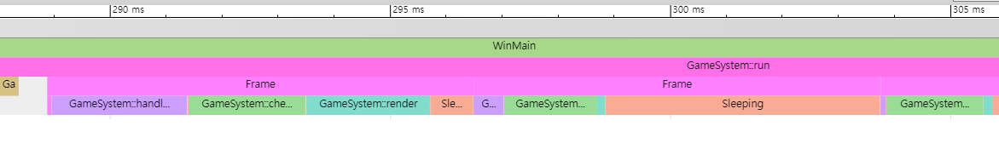

# Profiler
Visually profile your program using Chrome's tracing page(```chrome://tracing/```).    
As it involves inserting profiling code into your program, it falls under the category of instumentation profiling.   
This project was inspired by a [Youtube Video](https://www.youtube.com/watch?v=xlAH4dbMVnU) by Cherno.   

## Requirements
    C++20
## How to Use
1. Include ```Profiler.hpp``` in your project.
2. Insert ```PROFILE_FUNCTION();``` at the beginning of a function you want to profile.
3. Alternatively, you can use ```PROFILE_SCOPE("Custom Name");``` if you want to use a specific name.
4. Run your program
5. After execution, ```profile_result.json``` will be generated. Drag and drop this file onto Chrome's tracing page(```chrome://tracing/```)

You can easily include or exclude profiling code during the compilation step simply by setting the ```PROFILE``` macro to either 1 or 0.
```
// Profiler.hpp
#define PROFILE 1 
```
Setting it to 1 enables profiling, while setting it to 0 disables it.

### Example
```C++
// main.cpp
#include "Profiler.hpp"
#include <iostream>

void function1() {
    PROFILE_FUNCTION();
    for (size_t i = 0; i < 1000; ++i) {
        PROFILE_SCOPE("function1 loop");
        std::cout << "function1\n";
    }
}

void function2() {
    PROFILE_FUNCTION();
    for (size_t i = 0; i < 1000; ++i) {
        PROFILE_SCOPE("function2 loop");
        std::cout << "function2\n";
    }
}

int main() {
    PROFILE_FUNCTION();
    std::jthread t1(function1);
    std::jthread t2(function2);
    return 0;
}
```
## Image
### main.cpp

### [Breakout](https://github.com/sangingeum/Breakout)



